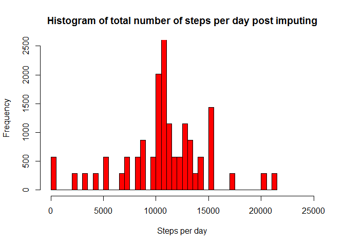

# PA1_template.Rmd
Chandrahas Penchala  
May 11, 2017  


## Install and load required packages


```r
# Loading libraries
is.installed <- function(my_pkg) {
  is.element(my_pkg, installed.packages()[,1])
}

if (!is.installed("data.table")){
  install.packages("data.table")
  install.packages("lattice")
}
library(data.table)
library(lattice)
```

Now download, unzip and load raw data into R.

After the data is loaded into R, I am showing the first 6 records of the raw data, along with summary and structure of data just to get a feel of what we have.


```r
raw_data_url <- "https://d396qusza40orc.cloudfront.net/repdata%2Fdata%2Factivity.zip"
download.file(url = raw_data_url,"raw_data_file.zip")
raw_data <- fread(input = unzip(zipfile = "raw_data_file.zip"),sep = ",",header = TRUE, na.strings = "NA")
head(raw_data)
```

```
##    steps       date interval
## 1:    NA 2012-10-01        0
## 2:    NA 2012-10-01        5
## 3:    NA 2012-10-01       10
## 4:    NA 2012-10-01       15
## 5:    NA 2012-10-01       20
## 6:    NA 2012-10-01       25
```

```r
summary(raw_data)
```

```
##      steps            date              interval     
##  Min.   :  0.00   Length:17568       Min.   :   0.0  
##  1st Qu.:  0.00   Class :character   1st Qu.: 588.8  
##  Median :  0.00   Mode  :character   Median :1177.5  
##  Mean   : 37.38                      Mean   :1177.5  
##  3rd Qu.: 12.00                      3rd Qu.:1766.2  
##  Max.   :806.00                      Max.   :2355.0  
##  NA's   :2304
```

```r
str(raw_data)
```

```
## Classes 'data.table' and 'data.frame':	17568 obs. of  3 variables:
##  $ steps   : int  NA NA NA NA NA NA NA NA NA NA ...
##  $ date    : chr  "2012-10-01" "2012-10-01" "2012-10-01" "2012-10-01" ...
##  $ interval: int  0 5 10 15 20 25 30 35 40 45 ...
##  - attr(*, ".internal.selfref")=<externalptr>
```

copying raw data into another variable for the first part of assignment.


```r
raw_data_copy<-raw_data
```

## What is mean total number of steps taken per day?

For this part of the assignment, you can ignore the missing values in the dataset.

1. Calculate the total number of steps taken per day
2. Make a histogram of the total number of steps taken each day
3. Calculate and report the mean and median of the total number of steps taken per day


```r
#Calculate the total number of steps taken per day
raw_data_copy[,total_steps_per_day:=sum(steps),by = date]
#let us see the summary to get a feel of the new column
summary(raw_data_copy)
```

```
##      steps            date              interval      total_steps_per_day
##  Min.   :  0.00   Length:17568       Min.   :   0.0   Min.   :   41      
##  1st Qu.:  0.00   Class :character   1st Qu.: 588.8   1st Qu.: 8841      
##  Median :  0.00   Mode  :character   Median :1177.5   Median :10765      
##  Mean   : 37.38                      Mean   :1177.5   Mean   :10766      
##  3rd Qu.: 12.00                      3rd Qu.:1766.2   3rd Qu.:13294      
##  Max.   :806.00                      Max.   :2355.0   Max.   :21194      
##  NA's   :2304                                         NA's   :2304
```

```r
#Make a histogram of the total number of steps taken each day
hist(raw_data_copy$total_steps_per_day,
     xlab = "Steps per day",
     xlim = c(0,25000),
     ylim = c(0,2500),
     col="red",
     breaks=60, #60 looks optimal here.
     main = "Histogram of total number of steps per day")
```

<!-- -->

```r
#Calculate and report the mean and median of the total number of steps taken per day
mean_before_imputing<-mean(raw_data_copy$total_steps_per_day,na.rm = TRUE)   #ignoring missing values
mean_before_imputing
```

```
## [1] 10766.19
```

```r
median_before_imputing<-median(raw_data_copy$total_steps_per_day,na.rm = TRUE) #ignoring missing values
median_before_imputing
```

```
## [1] 10765
```

## What is the average daily activity pattern?

1. Make a time series plot (i.e. type = "l") of the 5-minute interval (x-axis) and the average number of steps taken, averaged across all days (y-axis)
2. Which 5-minute interval, on average across all the days in the dataset, contains the maximum number of steps?

Now to figure out the "average daily activity pattern" based on the 5 minute interval across all the days, we need to first calculate the average steps taken in each of the 5 minute intervals across all days. This is how we do it:


```r
#Calculate the total mean of steps per 5 min interval across all days. Removing NA while calculating mean. Otherwise mean is turning up to be NA for all intervals
raw_data_copy[,mean_steps_per_interval:=mean(steps,na.rm = TRUE),by = interval]
#let us see the summary to get a feel of the new column
summary(raw_data_copy)
```

```
##      steps            date              interval      total_steps_per_day
##  Min.   :  0.00   Length:17568       Min.   :   0.0   Min.   :   41      
##  1st Qu.:  0.00   Class :character   1st Qu.: 588.8   1st Qu.: 8841      
##  Median :  0.00   Mode  :character   Median :1177.5   Median :10765      
##  Mean   : 37.38                      Mean   :1177.5   Mean   :10766      
##  3rd Qu.: 12.00                      3rd Qu.:1766.2   3rd Qu.:13294      
##  Max.   :806.00                      Max.   :2355.0   Max.   :21194      
##  NA's   :2304                                         NA's   :2304       
##  mean_steps_per_interval
##  Min.   :  0.000        
##  1st Qu.:  2.486        
##  Median : 34.113        
##  Mean   : 37.383        
##  3rd Qu.: 52.835        
##  Max.   :206.170        
## 
```

```r
#Make a time series plot (i.e. type = "l") of the 5-minute interval (x-axis) and the average number of steps taken, averaged across all days (y-axis)
with(raw_data_copy,
     plot(x = interval,
          y = mean_steps_per_interval,
          type = "l",
          xlab = "Interval",
          xlim = c(0,2500),
          ylab = "Average steps across all days",
          ylim = c(0,250),
          col = "red",
          main = "Time Series: Average steps across all days vs Interval"
          )
    )
```

<!-- -->

```r
#Which 5-minute interval, on average across all the days in the dataset, contains the maximum number of steps?
top_steps_interval <- unique(raw_data_copy[which(raw_data_copy$mean_steps_per_interval == max(raw_data_copy$mean_steps_per_interval)),interval])
top_steps_interval
```

```
## [1] 835
```

Even the graph has its highest point at interval 835!

## Imputing missing values

For the second part of the assignment, we will be imputing missing values. Lets do that!

1. Calculate and report the total number of missing values in the dataset (i.e. the total number of rows with NAs)


```r
#Calculate and report the total number of missing values in the dataset (i.e. the total number of rows with NAs)
count_of_missing_steps<-sum(is.na(raw_data_copy$steps))
count_of_missing_steps
```

```
## [1] 2304
```

so total number of rows with missing values are 2304. This same number was also visible in the summary of raw data generated at the begining.

2. Devise a strategy for filling in all of the missing values in the dataset. The strategy does not need to be sophisticated. For example, you could use the mean/median for that day, or the mean for that 5-minute interval, etc.

The strategy that I would like to use to imput the missig values is to substitute missing values with the mean of steps for that interval across all days. This is already calculated above. So now let us just imput the calculated values to replace NAs with them.

3. Create a new dataset that is equal to the original dataset but with the missing data filled in.

After processing the data and creating a new data set, I am also showing the first 6 records of the processed data, along with summary and structure of new data just to get a feel of what we have.


```r
new_steps<-raw_data_copy$steps #first copy the actual steps
#now replace NAs in new_steps with the mean steps per interval in raw_data_copy
new_steps[is.na(new_steps)]<-raw_data_copy$mean_steps_per_interval[is.na(new_steps)]
#using column bind to form a new and processed data set
processed_data<-as.data.table(cbind(new_steps,raw_data_copy$date,raw_data_copy$interval))
names(processed_data) <-c("steps","date","interval")
processed_data$steps<-as.numeric(processed_data$steps) #converting to numeric
#Not conveting date to date type as it is not required for assignment
processed_data$interval<-as.numeric(processed_data$interval) #converting to numeric
#let us see the new data set
head(processed_data)
```

```
##        steps       date interval
## 1: 1.7169811 2012-10-01        0
## 2: 0.3396226 2012-10-01        5
## 3: 0.1320755 2012-10-01       10
## 4: 0.1509434 2012-10-01       15
## 5: 0.0754717 2012-10-01       20
## 6: 2.0943396 2012-10-01       25
```

```r
summary(processed_data)
```

```
##      steps            date              interval     
##  Min.   :  0.00   Length:17568       Min.   :   0.0  
##  1st Qu.:  0.00   Class :character   1st Qu.: 588.8  
##  Median :  0.00   Mode  :character   Median :1177.5  
##  Mean   : 37.38                      Mean   :1177.5  
##  3rd Qu.: 27.00                      3rd Qu.:1766.2  
##  Max.   :806.00                      Max.   :2355.0
```

```r
str(processed_data)
```

```
## Classes 'data.table' and 'data.frame':	17568 obs. of  3 variables:
##  $ steps   : num  1.717 0.3396 0.1321 0.1509 0.0755 ...
##  $ date    : chr  "2012-10-01" "2012-10-01" "2012-10-01" "2012-10-01" ...
##  $ interval: num  0 5 10 15 20 25 30 35 40 45 ...
##  - attr(*, ".internal.selfref")=<externalptr>
```

4. Make a histogram of the total number of steps taken each day and calculate and report the mean and median total number of steps taken per day.


```r
#calculate sum of steps per day
processed_data[,total_steps_per_day:=sum(steps),by = date]
#plot histogram
hist(processed_data$total_steps_per_day,
     xlab = "Steps per day",
     xlim = c(0,25000),
     ylim = c(0,2500),
     col="red",
     breaks=60, #60 looks optimal here.
     main = "Histogram of total number of steps per day post imputing")
```

<!-- -->

```r
#Calculate and report the mean and median of the total number of steps taken per day
mean_after_imputing<-mean(processed_data$total_steps_per_day)
mean_after_imputing
```

```
## [1] 10766.19
```

```r
median_after_imputing<-median(processed_data$total_steps_per_day)
median_after_imputing
```

```
## [1] 10766.19
```

Mean before imputing  : 1.0766189\times 10^{4}  
Mean after imputing   : 1.0766189\times 10^{4}

Median before imputing  : 1.0765\times 10^{4}  
Median after imputing   : 1.0766189\times 10^{4}

So we see that the mean did not change. But median after imputing became equal to mean before imputing. This is because of the strategy used to imput.

## Are there differences in activity patterns between weekdays and weekends?

For this part the weekdays() function may be of some help here. Use the dataset with the filled-in missing values for this part.

1. Create a new factor variable in the dataset with two levels - "weekday" and "weekend" indicating whether a given date is a weekday or weekend day. 


```r
processed_data[,week_day:=as.factor(ifelse(weekdays(as.Date(date)) %in% c("Sunday","Saturday"),"weekend","weekday"))]

#let us see the summary to get a feel of the new column
summary(processed_data)
```

```
##      steps            date              interval      total_steps_per_day
##  Min.   :  0.00   Length:17568       Min.   :   0.0   Min.   :   41      
##  1st Qu.:  0.00   Class :character   1st Qu.: 588.8   1st Qu.: 9819      
##  Median :  0.00   Mode  :character   Median :1177.5   Median :10766      
##  Mean   : 37.38                      Mean   :1177.5   Mean   :10766      
##  3rd Qu.: 27.00                      3rd Qu.:1766.2   3rd Qu.:12811      
##  Max.   :806.00                      Max.   :2355.0   Max.   :21194      
##     week_day    
##  weekday:12960  
##  weekend: 4608  
##                 
##                 
##                 
## 
```

```r
#seeing structure to confirm a factor is created
str(processed_data)
```

```
## Classes 'data.table' and 'data.frame':	17568 obs. of  5 variables:
##  $ steps              : num  1.717 0.3396 0.1321 0.1509 0.0755 ...
##  $ date               : chr  "2012-10-01" "2012-10-01" "2012-10-01" "2012-10-01" ...
##  $ interval           : num  0 5 10 15 20 25 30 35 40 45 ...
##  $ total_steps_per_day: num  10766 10766 10766 10766 10766 ...
##  $ week_day           : Factor w/ 2 levels "weekday","weekend": 1 1 1 1 1 1 1 1 1 1 ...
##  - attr(*, ".internal.selfref")=<externalptr>
```

2. Make a panel plot containing a time series plot (i.e. type = "l") of the 5-minute interval (x-axis) and the average number of steps taken, averaged across all weekday days or weekend days (y-axis).


```r
processed_data[,mean_steps_per_interval:=mean(steps),by = list(interval,week_day)]
xyplot(mean_steps_per_interval~interval|week_day,
       data = processed_data,
       layout = c(1,2),
       col ="red",
       type = "l",
       ylab = "Number of steps",
       ylim = c(0,250),
       xlim = c(0,2500),
       main =  "Time Series:Average steps vs Interval grouped by weekday or weekends"
       )
```

<!-- -->

